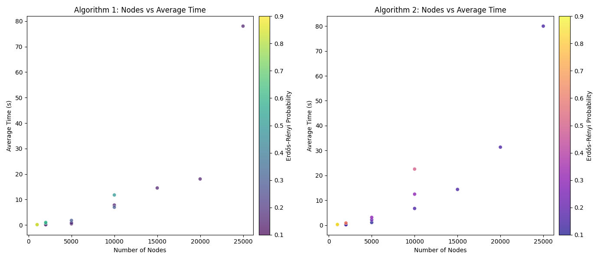

## RESULTS

* Fig. 1: Results on single instance for Alg. 1 and Alg. 2

| Nodes | Paths | Avg. Edges | Prob | Avg. Time Alg. 1 (s) | Avg. Time Alg. 2 (s) |
|-------|-------|------------|------|----------------------|----------------------|
| 1000  | 10    | 502399     | 0.5  | 0.09336749999783933  | 0.1831248999806121   |
| 1000  | 10    | 699519     | 0.7  | 0.1454029000014998   | 0.2509297000069637   |
| 1000  | 10    | 896522     | 0.9  | 0.16684950000490062  | 0.3208556000026874   |
| 2000  | 10    | 417570     | 0.1  | 0.08238989999517798  | 0.16066610001144     |
| 2000  | 10    | 615142     | 0.15 | 0.19636200001696125  | 0.2418628000013996   |
| 2000  | 10    | 2402249    | 0.6  | 0.7472393999923952   | 0.9098188000207301   |
| 2000  | 10    | 2401229    | 0.6  | 1.0418493000033777   | 0.8672446999989916   |
| 5000  | 10    | 2541869    | 0.1  | 0.4836341999762226   | 1.0960259000130463   |
| 5000  | 10    | 5033546    | 0.2  | 0.8764533000066876   | 2.154375299985986    |
| 5000  | 10    | 7526717    | 0.3  | 1.8186003000009805   | 3.153088299994124    |
| 10000 | 10    | 15069899   | 0.15 | 7.833593999996083    | 6.729309399990598    |
| 10000 | 10    | 30051123   | 0.3  | 6.97420119997696     | 12.478544600016903   |
| 10000 | 10    | 50031362   | 0.5  | 11.791635500005214   | 22.55191099998774    |
| 15000 | 10    | 33861910   | 0.15 | 14.536505500000203   | 14.378192999982275   |
| 20000 | 10    | 60149311   | 0.15 | 18.072751600004267   | 31.357023400021717   |
| 25000 | 10    | 93944399   | 0.15 | 78.06360250001308    | 79.98291510000126    |

* Table 1: Results for Alg. 1 and Alg. 2